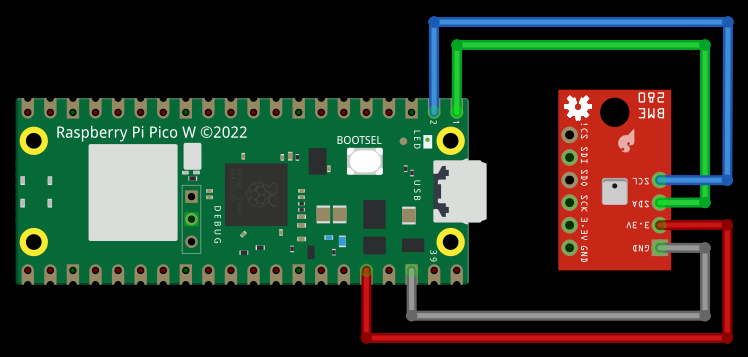

# WuPicoWeather

Weather station using Raspberry Pi Pico W microcontroller with BME280 environmental sensor which can measure temperature, pressure and humidity. Sensor data can be uploaded to Weather Underground for display.

# Motivation

The longstanding supply chain shortage of Raspberry Pi computers (Pi Zero/3/4) prevented author from working on any new projects. One of these was deploying additional weather monitoring stations, see the [WuPiWeather](https://github.com/efranzwa/WuPiWeather "https://github.com/efranzwa/WuPiWeather") GitHub project.

Secondary motivation was to learn more about microcontrollers and MicroPython.  The result is the Wu**Pico**Weather project which essentially performs an identical function as Wu**Pi**Weather. However, the methods of interacting, coding and verifying operation of microcontrollers turns out to be substantially different than Linux based single board computers (SBCs).


# Hardware Configuration



Connect BME280 sensor to Raspberry Pi Pico GPIO using table below as reference. The [raspberrypi.com](https://datasheets.raspberrypi.com/picow/PicoW-A4-Pinout.pdf "https://datasheets.raspberrypi.com/picow/PicoW-A4-Pinout.pdf") website has a good GPIO reference diagram to use when connecting devices to the Raspberry Pi. Place sensor away from any heat sources to improve temperature measurement accuracy. The I2C serial bus wire harness length could be extended up to 1 meter. For more technical details about the BME280 sensor please see the datasheet here [BME280 Sensor Datasheet](https://www.bosch-sensortec.com/media/boschsensortec/downloads/product_flyer/bst-bme280-fl000.pdf "https://www.bosch-sensortec.com/media/boschsensortec/downloads/product_flyer/bst-bme280-fl000.pdf").

| BME280 | RPi    | RPi Pin  | Description          |
| :----: | :----: | :----:   | :----:               |
| VDD    | 3v3    | 36       | Power Supply         |
| SDO    | SDA    | 1        | I2C Serial Bus Data  |
| SCK    | SCL    | 2        | I2C Serial Bus Clock |
| GND    | Ground | 38       | Ground               |

# mpremote Installation

Although there are several methods to interact with a microcontroller such as RPi Pico, this guide will focus on command line methods as they are simplest and more universally available on various OS platforms. The `mpremote` command line tool is a preferred method to interact with a MicroPython device over a serial bus. However, if one wants or needs a more graphical method to interact with the device, the author recommends [Thonny](https://thonny.org/ "https://thonny.org/") integrated development environment (IDE) as it is optimized for Python/MicroPython. Installation and usage of Thonny is outside the scope of this project. Modification of the `PATH` environment variable may be needed if pip installs to ~/.local/bin which is the case for many Linux distributions.
```
$ echo 'PATH=$PATH:~/.local/bin' >> .bashrc
$ source ~/.bashrc
$ pip install mpremote
$ mpremote connect list          # this will show devices on usb
$ mpremote connect /dev/ttyACM0  # make test connection to verify 
Connected to MicroPython at /dev/ttyACM0
Use Ctrl-] to exit this shell    # press ctrl-] to exit shell
$

```

# MicroPython Installation

This guide assumes you are using a Raspberry Pi Pico W. Host computer OS is assumed to be Linux so some of the commands may be slightly different depending on the flavor of OS and your specific environment details. Some very minor code modifications are needed if using a non-W RPi. The W version of RPi hardware is recommended as it facilitates remote placement of the weather station. The code should also work on other MicroPython based microcontrollers with minor modifications. Connect Raspberry Pi Pico W to USB port on your computer. Download MicroPython and flash firmware to the device.
```
$ cd ~
$ wget https://micropython.org/download/rp2-pico-w/rp2-pico-w-latest.uf2
$ cp rp2-pico-w-latest.uf2 /media/<username>/RPI-RP2
```

# Software Configuration

Clone WuPicoWeather and BME280 project repositories into the current user home directory. BME280 project contains a necessary device driver for the sensor.

```
$ cd ~
$ git clone https://github.com/robert-hh/BME280.git
$ mpremote cp BME280/bme280_float.py :
$ git clone https://github.com/efranzwa/WuPicoWeather.git
```

# Sensor Verification

Use the `getaddress.py` script to determine the sensor address on I2C bus. Note that the code assumes Pin connections are made per the table above.
```
$ cd WuPicoWeather/wpicow
$ mpremote run getaddress.py
Sensor I2C port:  0
Sensor I2C address:  [119]
```
Use the `verifysensor.py` script to verify that everything is working correctly prior to deploying the full weather station. The sensor will take 3 readings at 10 second intervals and the output should display temperature, pressure and humidity in metric units. Please also notice that the device LED will flash on/off in 1 second intervals.  This helps to verify that the code is running as expected.

```
$ mpremote run verifysensor.py
('19.69C', '1002.30hPa', '34.70%')
('19.70C', '1002.28hPa', '34.68%')
('19.72C', '1002.31hPa', '34.72%')
$
```

# WiFi Configuration
Edit `config.py` with your favorite editor. My favorite is `vi` and should also be yours :sunglasses:.  Modify the "my-wifi-ssid" and "my-wifi-password" with your wifi credentials, keep the quotes. Keep in mind that the Pico W only works on 2.4G WiFi channels so make sure your access point has this enabled. Use the `wlanc.py` script to verify the device can make a successful WiFi connection.
```
$ mpremote run wlanc.py
starting wifi
waiting for connection....connected
ip = 192.168.3.130
$
```

# Weather Station Configuration

Edit `config.py` with your favorite editor, which is `vi` by the way.  Use the PORT and ADDRESS from sensor  verification.  INTERVAL sets time between sensor readings and is recommended at 300 seconds.  STATION ID and STATION KEY will come from your registration with Weather Underground.  WU URL is the address used for data upload. ALTITUDE will correct for local atmospheric pressure relative to sea level, enter this in feet. It may be noted that the config.py is a python dictionary with data in key:value pairs.

```
$ cat config.py
cfg = {
    "wlan": {
        "ssid" : "my-wifi-ssid",
        "pswd" : "my-wifi-password"
    },
    "station": {
        "header": "wpicow",
        "port": "0",
        "address": "119",
        "interval": "300",
        "station_id": "my-station-id",
        "station_key": "my-station-key",
        "wu_url": "https://weatherstation.wunderground.com/weatherstation/updateweatherstation.php",
        "altitude": "100"
    }
}
```

# Weather Station

Configuration and verification of the required files is complete if all steps above have completed successfully. Copy python files from local project repository to the Raspberry Pi Pico W. Note that the getaddress.py and verifysensor.py are not needed to run the weather station but could be used to verify/debug sensor if needed.  Author has found that the sensors eventually degrade and stop functioning, most likely due to harsh weather exposure.
```
$ mpremote cp config.py :
$ mpremote cp getaddress.py :
$ mpremote cp main.py :
$ mpremote cp urlencode.py :
$ mpremote cp verifysensor.py :
$ mpremote cp wlanc.py :
```

Perform a hard reset of device using mpremote. After hard reset the device should automatically run the `main.py` script which is the weather station code.
```
$ mpremote exec "import machine; machine.reset()"
```
At this point the WuPicoWeather should be running. As with the sensor verification step, the device LED should flash on/off in 1 second intervals as a sign that the code is still running and no fatal errors have been encountered which would stop the code execution.

# Weather Data

After data has been uploading to Weather Underground you will be able to view the personal weather station (PWS) web page. Address for the PWS should be as follows using your registered station ID: https://www.wunderground.com/dashboard/pws/my-station-id.


